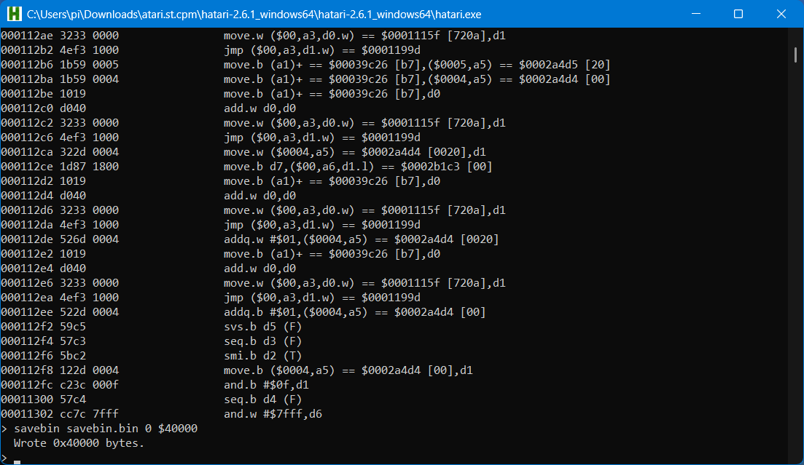

# How this code was extracted and built

I used the Hatari Atari-ST Emulator as the platform used to run the Atari-ST CP/M Emulator v8.4 by SoftDesign Munich.  In order for this to run, I had to ensure Hatari was running a compatible ROM.  In my case, I used the US TOS 1.62 version.

Run the following command from a Windows shell to start Hatari.  Will be different on non-Windows platform.

./hatari.exe --wincon

click ok

press F12 to bring up the Hatari main menu

click floppy disks, for Drive A:, browse to file containing the img file for the CP/M Emulator.  Go back to main menu and click OK.

Open Drive A and double click on CPMZ80.TOS

When asked to insert floppy, click F12

Go into floppy disk menu, browse to CP/M system floppy img.

Exit menu

Type dir and press enter.

Type type happy.txt and do not press enter.

Get ready to quickly press press the alt-pause key to enter the Hatari debug console.

Note:  The reason for entering the Hatari debug console while the type happy.txt is running, is to ensure the emulator is currently running the emulation loop, so the registers and the program counter are set with the values used when the loop is running, making it far easier to analyze the code.

Press enter followed quickly by pressing alt-pause key.

We are now in the Hatari debug console.

Enter r to examine the cpu state.

Enter d $118e4 to list the assembly code that will execute next.

In this case, we can see code that is fairly typical of emulators.  Each instruction typically has a small number of assembly lines that perform the function of the opcode that it is emulating, followed by code to either jump back to the emulation loop or in this case, do what the emulation loop typically does.  Either way, instruction code blocks typically end with some kind of jump or branch instruction that will be the same for each block.  Here we see such a repeating block, starting with the add.w d0,d0 and ending with the jmp ($00,a3,d0.w).

Enter r to again look at the cpu state and let's see what the A3 register value is.

Let's look at the memory of the value we see.

Enter m $110aa

This looks a lot like a typical emulation jump table.  In the case of 8-bit processors, we expect to see a jump table with 256 entries.  In this case, the entries appear to be 2 byte long, so the total table length is 512 bytes.  The first table entry is 0200, which happens to be the length of the table.  So it appears as if the entries are relative jump values that are added to the table starting address.  As we can see, the values are gradually increasing as would be expected.

So next, let's look at the code pointed to by the first entry, 110aa + 200 = 112aa.

Enter m $112aa

This does look as expected for a z80.  Opcode 0 for a z80 is the nop instruction, which basically does nothing.  The code we see here just has the code we see at the end of every instruction code block, with nothing before it.  In other words, the code does not but jump to the next instruction.

At this point, we have done enough analysis of the code to have an idea of where the code is located.  So let's dump the binary code of the first 256 KBytes of memory, more than is probably needed.

Enter savebin savebin.bin 0 $40000

The next steps will be to identify the parts of this saved binary code to extract and disassemble.  This will require further analysis.

This may be expanded, not sure, but it is enough to get started.

