# How this code was extracted and built

I used the Hatari Atari-ST Emulator as the platform used to run the Atari-ST CP/M Emulator v8.4 by SoftDesign Munich.  In order for this to run, I had to ensure Hatari was running a compatible ROM.  In my case, I used the US TOS 1.62 version.

Run the following command from a Windows shell to start Hatari.  Will be different on non-Windows platform.

./hatari.exe --wincon

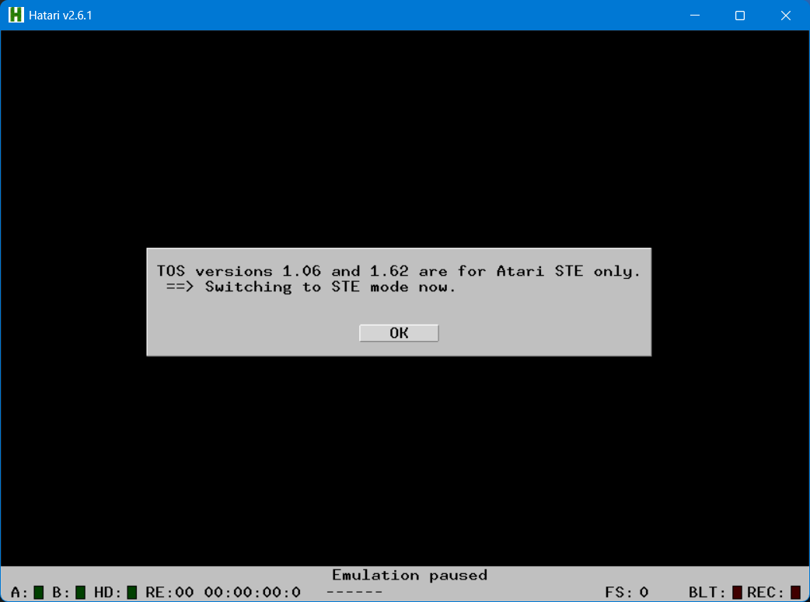

click ok

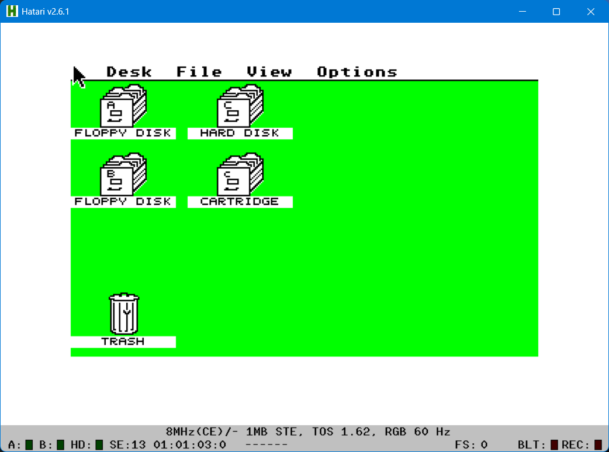

press F12 to bring up the Hatari main menu

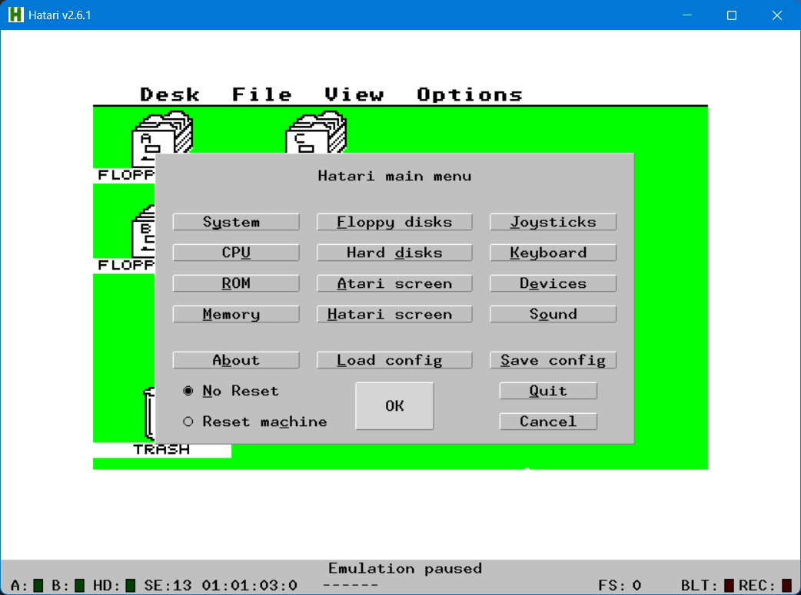

click floppy disks, for Drive A:, browse to file containing the img file for the CP/M Emulator.  Go back to main menu and click OK.

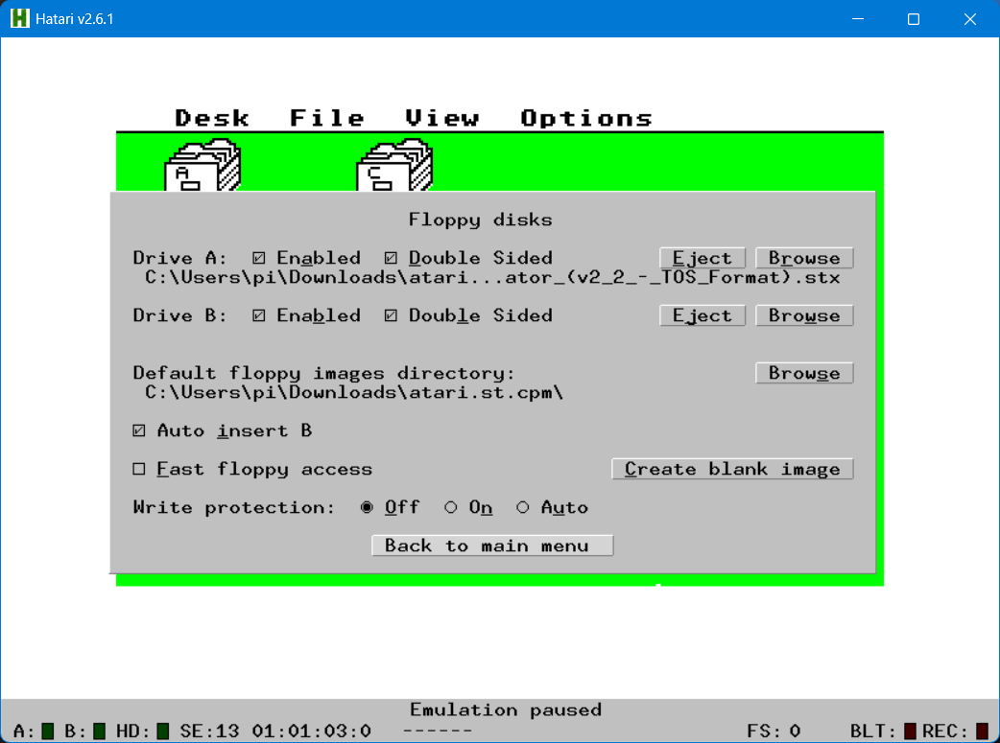

Open Drive A and double click on CPMZ80.TOS

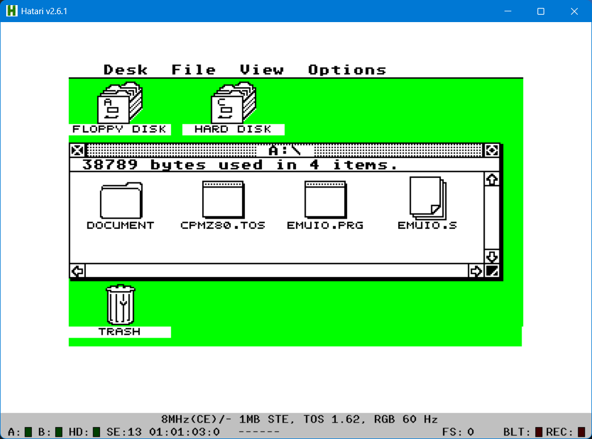

When asked to insert floppy, click F12, go into floppy disk menu, browse to CP/M system floppy img and exit menu.

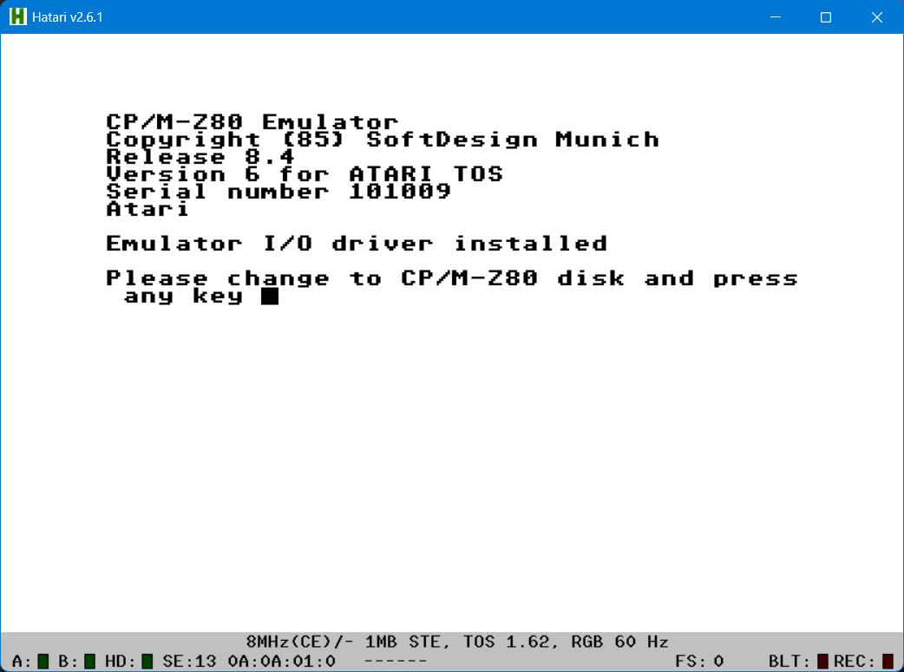

press any key

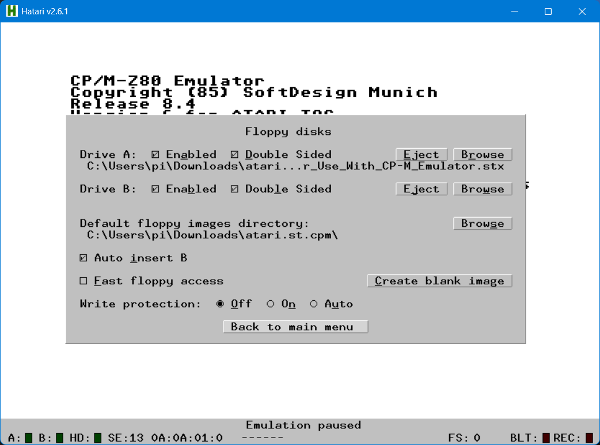

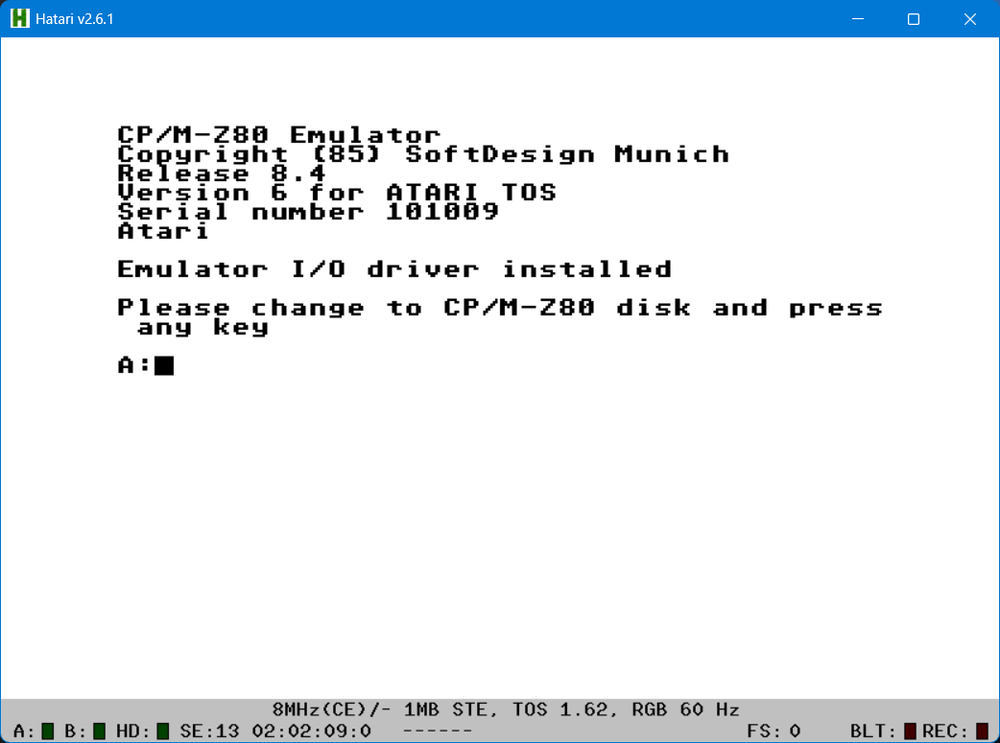
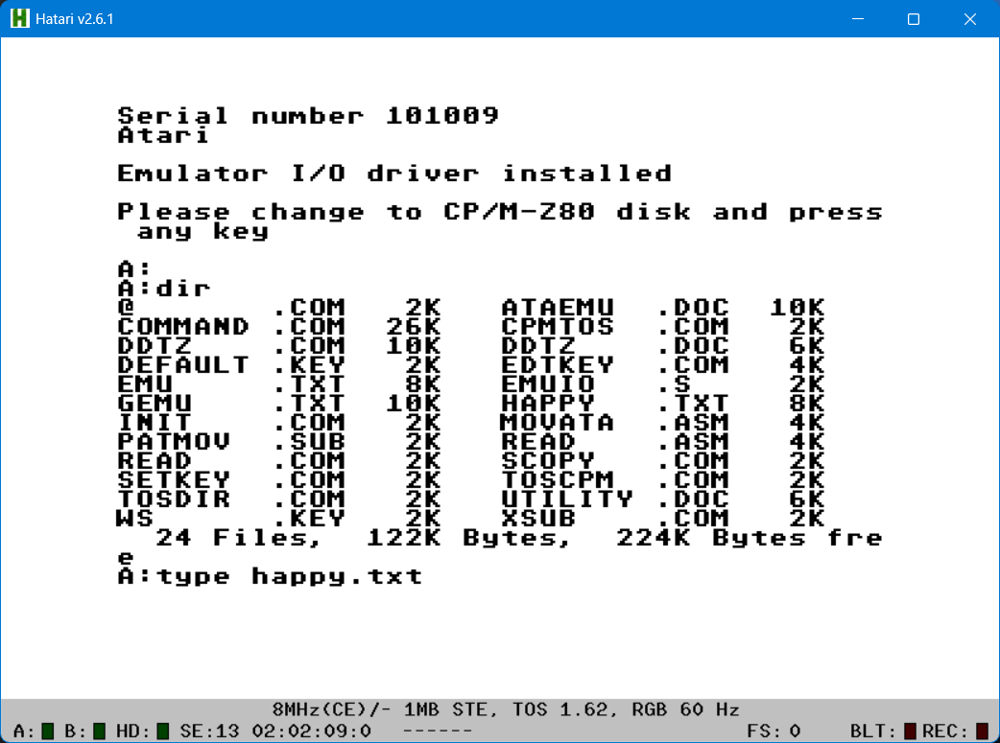
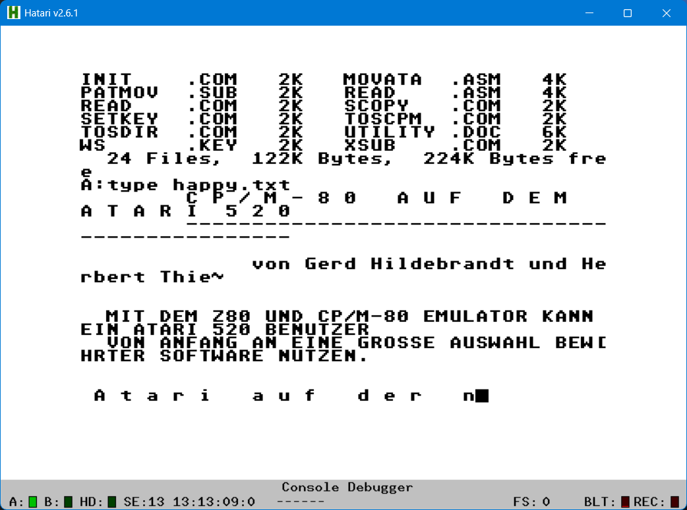
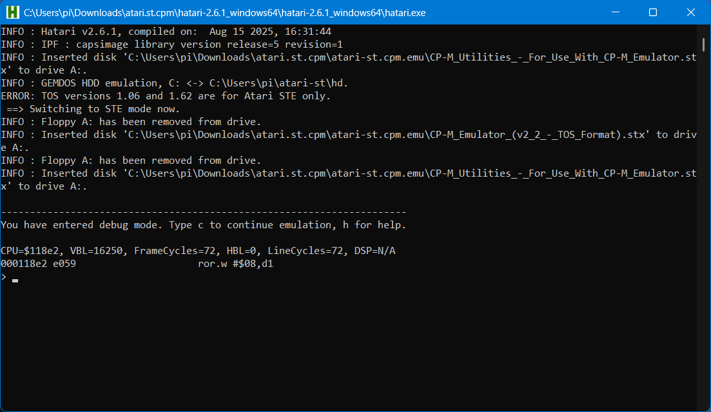
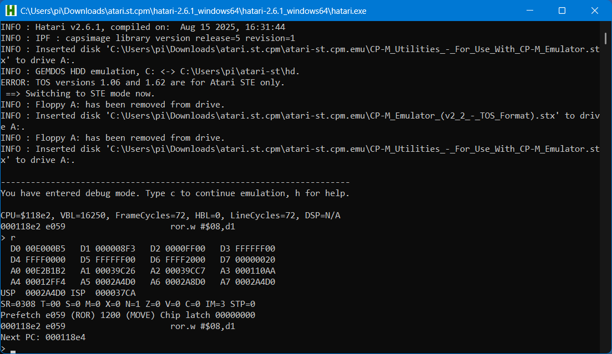
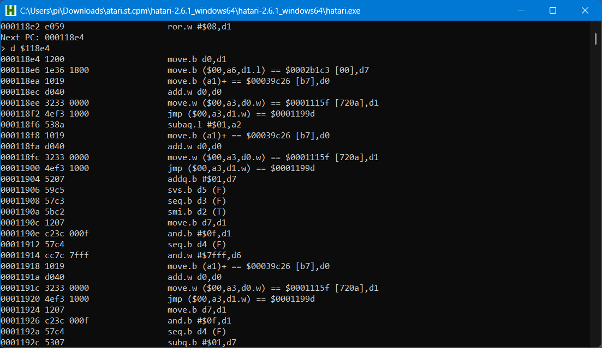
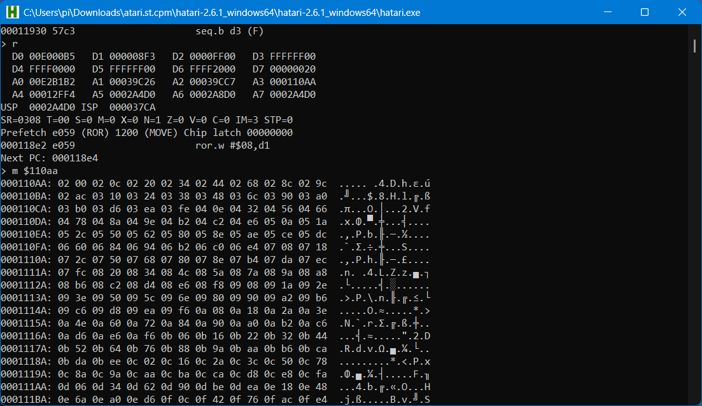
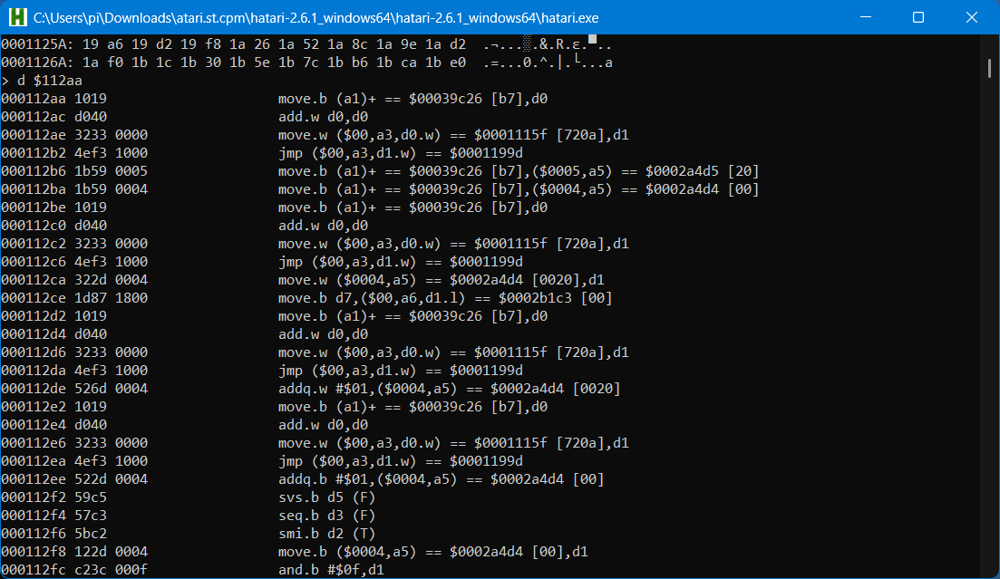
1

