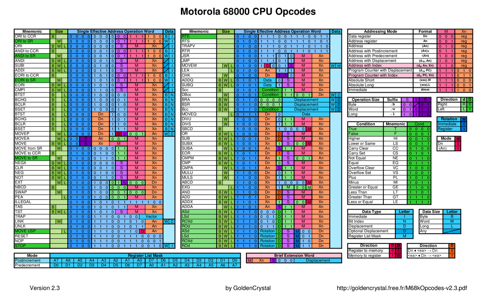

I found the following m68k disassembler written in python at some point in the past.  I cannot remember where it came from.

disasm68k.py     The python m68k disassembler
opcodetable.csv  Table used for decoding
opcodetable.ods  Does not require this file

Using it, I came across a number of small issues.  So I currently use my modified version of this disassembler, which is includes the following two files.

m68kdisasm.py       The python m68k disassember
opcodetable.csv  Table used for decoding

The modifications I made include the following changes.

- I added a grp variable to every instruction group to make it easier to identify the section where problems are occuring.  Each line of disassembled code starts with grp-xx.  This is also useful as I may eventually complete a javascript disassembler I started based on the same table.  This will make it easier to the python and javascript versions.
- I added a hardcoded s variable to grp 28 and grp 29 as it was not defined and was causing warnings.  I have not however confirmed this change is entirely correct, but it does correct the issues I was experiencing.  Further analysis of the code is needed to verify the proper way of setting the s variable.
- When printing a list version of the disassembled code, the bytes were each separated by a space.  I modified this to group the output as two bytes separated by a space, a more typical output format.
- The original formatted print statements, a capital X was used to specify hex output whereas all other format codes were lowercase.  So I changed all the uppercase X's to lowercase for consistency.  This does not affect the function of the code.

The following image file displays the decoding table in color.  I am again not sure where I found this image file.

m68k.opcodes.png

